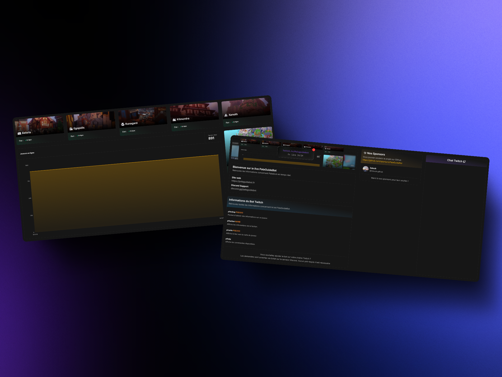

# PalaGuideBot Live 🎮

Ce projet utilise AdonisJS 6 + Inertia (SSR) + React, permettant d'afficher des informations sur Paladium et PalaGuideBot directement sur le [live PalaGuideBot](https://www.twitch.tv/palaguidebot).



## 🌟 Fonctionnalités

### Tableau de bord principal
- **Home Page** : Page principal, affichage des sponsors Github PalaGuideBot, chat Twitch
- **Statut du serveur** : Rapport en temps réel de l'état du serveur Paladium
- **Graphique des joueurs en ligne** : Visualisation en temps réel du nombre de joueurs connectés
- **Classements** : Leaderboards par catégorie (argent, faction, etc.)
- **Agenda** : Événements quotidiens et prochains

## 🛠️ Technologies utilisées

### Backend
- **[AdonisJS 6](https://adonisjs.com/)** - Framework Node.js moderne
- **[BentoCache](https://bentocache.dev/)** - Système de cache haute performance
- **TypeScript** - Typage statique

### Frontend
- **[React 19](https://reactjs.org/)** - Interface utilisateur
- **[Inertia.js](https://inertiajs.com/)** - Liaison backend/frontend
- **[Tailwind CSS 4](https://tailwindcss.com/)** - Framework CSS
- **[Radix UI](https://www.radix-ui.com/)** - Composants accessibles
- **[Recharts](https://recharts.org/)** - Graphiques et visualisations
- **[Lucide React](https://lucide.dev/)** - Icônes modernes
- **TypeScript** - Typage statique

### Outils de développement
- **Vite** - Build tool ultra-rapide
- **ESLint** - Linting du code
- **Prettier** - Formatage automatique
- **PNPM** - Gestionnaire de paquets performant

## 🚀 Installation et démarrage

### Prérequis
- Node.js 22+
- PNPM

### Installation

1. **Installez les dépendances**
```bash
pnpm install
```

2. **Copier le fichier d'environnement**
```bash
cp .env.example .env
```

3. **Générer une nouvelle ``APP_KEY``
```bash
node ace generate:key
```

4. **Variables d'environnement**
Renseigner les valeurs pour `PALADIUM_BASE_URL`, `PALADIUM_API_KEY` dans le fichier `.env`

4. **Démarrage en développement**
```bash
pnpm dev
```

## 📁 Structure du projet

```
├── app/                    # Backend AdonisJS
│   ├── controllers/        # Contrôleurs HTTP
│   ├── paladium/          # Logique spécifique Paladium
│   ├── cache/             # Système de cache
│   └── event/             # Gestion des événements
├── inertia/               # Frontend React
│   ├── pages/             # Pages de l'application
│   ├── components/        # Composants réutilisables
│   └── assets/            # Images et ressources
├── config/                # Configuration AdonisJS
├── providers/             # Services providers
└── public/                # Fichiers statiques
```

## 🤝 Contribution

Le projet est open-source, si vous avez des idées pour améliorer l'application, h'hésitez pas à ouvrir une issue ou à proposer une pull request.